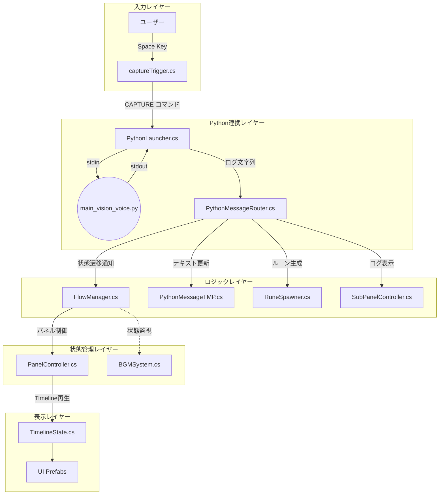
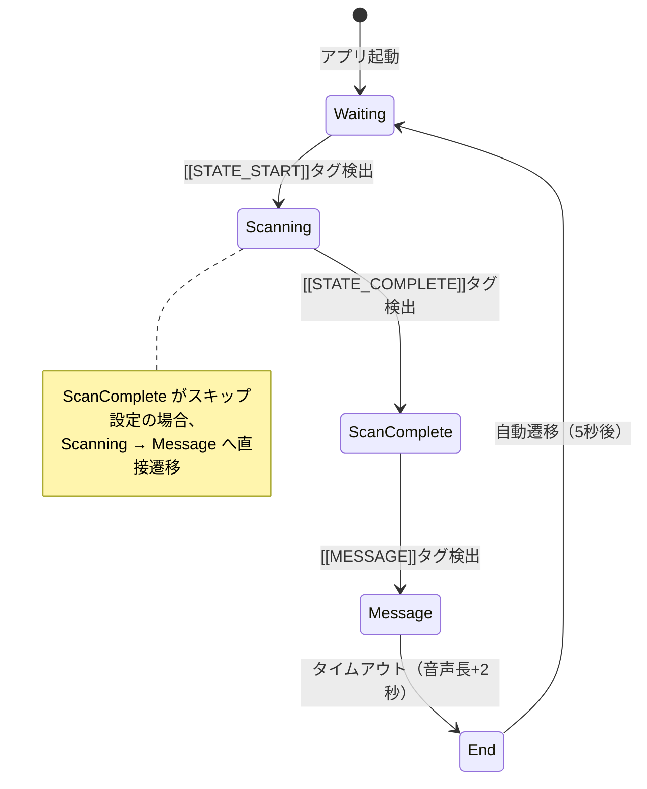
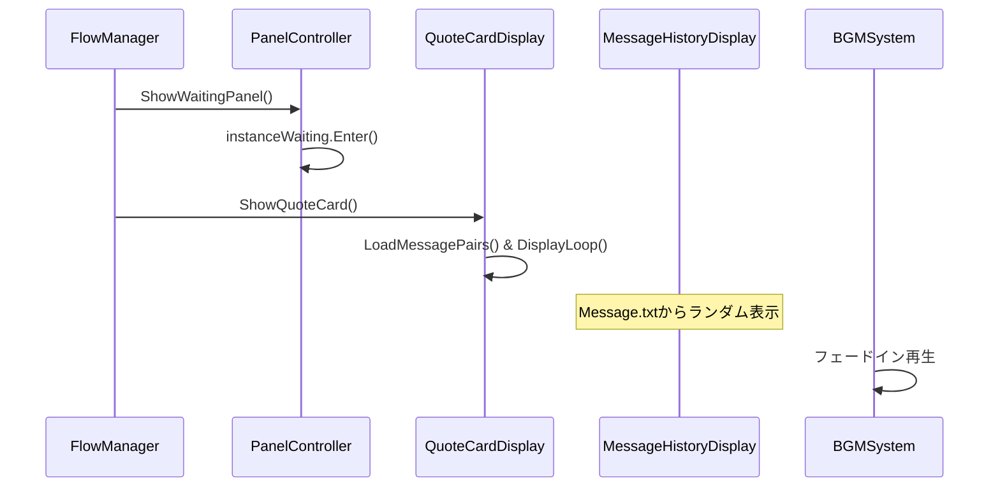
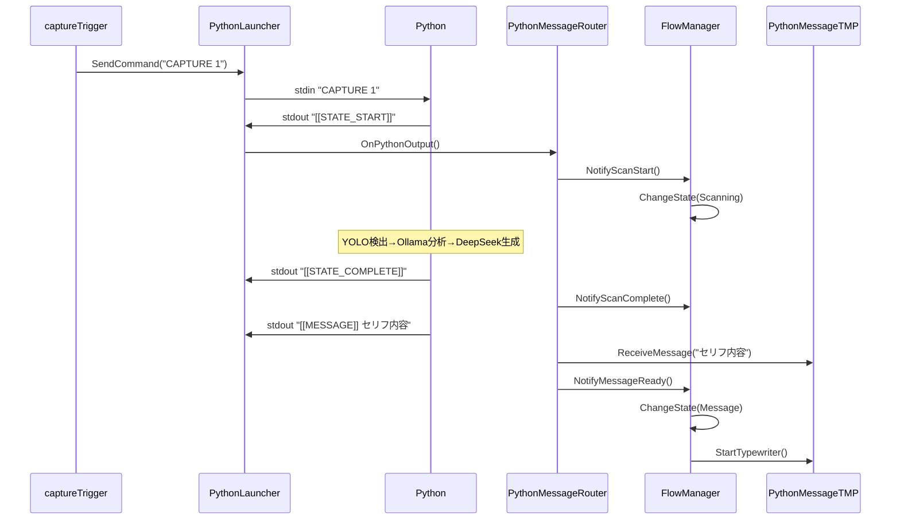

# Unity C# スクリプト構造・ロジックレポート

**作成日:** 2026-01-08  
**対象ディレクトリ:** `Assets/Scripts/`

本ドキュメントでは、Unity C# スクリプトの構造、役割、および主要なロジックフローを詳細に解説します。

---

## 1. システムアーキテクチャ概要



---

## 2. 状態遷移（FlowState）

`FlowManager.cs` が管理する5つの状態と遷移トリガー：



---

## 3. スクリプト分類と詳細ロジック

### 🔵 Core Managers（全体制御）

#### [FlowManager.cs](file:///Users/asanolab/Sotsusei1107/Assets/Scripts/FlowManager.cs)
**役割:** ステートマシンの中核。体験フロー全体を管理。

| メソッド | 呼び出し元 | 動作 |
|:---|:---|:---|
| `NotifyScanStart()` | PythonMessageRouter | Waiting → Scanning へ遷移 |
| `NotifyScanComplete()` | PythonMessageRouter | Scanning → ScanComplete へ遷移（スキップ判定あり） |
| `NotifyMessageReady()` | PythonMessageRouter | ScanComplete/Scanning → Message へ遷移 |
| `SetMessageDuration(float)` | MessageVoicePlayer | Message状態の表示時間を音声長+2秒に設定 |
| `ChangeState(FlowState)` | 内部 | 状態遷移の実行・パネル制御通知 |

**状態遷移ロジック:**
```csharp
private void ChangeState(FlowState newState)
{
    switch (currentState)
    {
        case FlowState.Waiting:
            panelController.ShowWaitingPanel();
            quoteCardDisplay?.ShowQuoteCard();
            break;
        case FlowState.Message:
            panelController.ShowMessagePanel();
            pythonMessageDisplay?.StartTypewriter();
            Invoke(nameof(OnMessageFinished), duration);
            break;
        // ...
    }
}
```

---

#### [PanelController.cs](file:///Users/asanolab/Sotsusei1107/Assets/Scripts/PanelController.cs)
**役割:** メインCanvasのUI切り替え。TimelineState Prefabを動的に生成・制御。

| プロパティ | 型 | 用途 |
|:---|:---|:---|
| `MessageDisplay` | PythonMessageTMP | Message Prefab内のテキスト表示コンポーネント |
| `RuneSpawnerDisplay` | RuneSpawner | ScanComplete Prefab内のルーン生成コンポーネント |
| `ScanningProgressDisplay` | ScanningProgressController | Scanning Prefab内の進捗制御コンポーネント |

**Skip設定:**
- `skipScanComplete`: ScanComplete画面をスキップ
- `skipEnd`: End画面をスキップ

---

#### [SubPanelController.cs](file:///Users/asanolab/Sotsusei1107/Assets/Scripts/SubPanelController.cs)
**役割:** サブディスプレイ（2画面目）の制御。Scanning中はログ表示、Message中はメッセージ表示。

| メソッド | 呼び出し元 | 動作 |
|:---|:---|:---|
| `SetStatus(string)` | PythonMessageRouter | Pythonログをリアルタイム表示（Scanning中） |
| `AddLogEntry(msg, credit)` | PythonMessageRouter | メッセージとクレジットを保存 |
| `ShowMessage()` | FlowManager | 保存されたメッセージをプレハブで表示、タイプライター開始 |
| `HideMessage()` | FlowManager | ステータスモードに戻りプレハブを削除 |

---

### 🟢 Python Integration（外部連携）

#### [PythonLauncher.cs](file:///Users/asanolab/Sotsusei1107/Assets/Scripts/PythonLauncher.cs)
**役割:** Pythonプロセスの起動・管理・通信

**プロセス間通信:**
```
Unity (C#) ──stdin──> Python (main_vision_voice.py)
Unity (C#) <──stdout── Python
```

| メソッド | 動作 |
|:---|:---|
| `Start()` | `/opt/homebrew/bin/python3.11` でPython起動、stdout/stderrをキャプチャ |
| `SendCommand(string)` | stdinへコマンド送信（例: `CAPTURE 1`） |
| `Update()` | resultQueueからログを取り出し、Routerへ転送 |
| `KillProcess()` | QUITコマンド送信後、2秒待機→強制終了 |

---

#### [PythonMessageRouter.cs](file:///Users/asanolab/Sotsusei1107/Assets/Scripts/PythonMessageRouter.cs)
**役割:** Pythonログの解析・振り分け。「司令塔」として各コンポーネントに通知。

**タグ検出ロジック:**
```csharp
public void OnPythonOutput(string line)
{
    if (line.Contains("[[STATE_START]]"))
        HandleScanStart();
    else if (line.Contains("[[CHARACTER]]"))
        HandleCharacter(line);  // キャラ名抽出
    else if (line.Contains("[[CREDIT]]"))
        HandleCredit(line);     // CV情報抽出
    else if (line.Contains("[[MESSAGE]]"))
        HandleMessage(line);    // セリフ抽出→表示
    else if (line.Contains("[[STATE_COMPLETE]]"))
        HandleScanComplete();
    // ...
}
```

**自動接続機構:**
- `TryGetDisplaysFromPanelController()` で PanelController から動的にコンポーネントを取得
- Prefab入れ替えにも対応

---

#### [captureTrigger.cs](file:///Users/asanolab/Sotsusei1107/Assets/Scripts/captureTrigger.cs)
**役割:** キー入力（スペース）を検知し、Pythonにキャプチャコマンドを送信

**入力制御ロジック:**
1. FlowStateがWaitingでなければ無視
2. クールダウン中（3秒）なら無視
3. カメラデバイスを検索（OBS等の仮想カメラを除外）
4. `CAPTURE <カメラインデックス>` を送信

---

### 🟡 Visual Effects & UI（演出・表示）

#### [PythonMessageTMP.cs](file:///Users/asanolab/Sotsusei1107/Assets/Scripts/PythonMessageTMP.cs)
**役割:** 生成されたメッセージ本文とクレジットを表示

| メソッド | 動作 |
|:---|:---|
| `ReceiveMessage(string)` | メッセージを保持しMessage.txtに追記 |
| `SetCredit(string)` | クレジット情報を保持し表示 |
| `StartTypewriter()` | TypewriterEffectTMPを開始 |

---

#### [TypewriterEffectTMP.cs](file:///Users/asanolab/Sotsusei1107/Assets/Scripts/TypewriterEffectTMP.cs)
**役割:** TextMeshProUGUIにタイプライター演出を適用

| プロパティ/イベント | 用途 |
|:---|:---|
| `delay` | 1文字あたりの表示間隔（デフォルト0.05秒） |
| `IsTyping` | タイピング中かどうか |
| `OnCharacterTyped` | 文字表示時に発火（TypingSoundPlayerが購読） |
| `OnTypingComplete` | タイピング完了時に発火 |

**部分表示対応:**
- `StartDisplayFromIndex(int)` で途中からタイピング開始可能
- MessageHistoryDisplayで「追加行のみ」タイピングする際に使用

---

#### [RuneSpawner.cs](file:///Users/asanolab/Sotsusei1107/Assets/Scripts/RuneSpawner.cs)
**役割:** メッセージを1文字ずつ空間に浮遊させるルーン文字演出

**生成ロジック:**
1. `SetMessage(string)` でメッセージ受信
2. `AutoSpawnLoop()` コルーチンでループ生成
3. 各文字を `RuneBehavior` 付きPrefabとして生成
4. 文字は `enchantTable` に向かって吸い込まれる

---

#### [MessageHistoryDisplay.cs](file:///Users/asanolab/Sotsusei1107/Assets/Scripts/MessageHistoryDisplay.cs)
**役割:** Waiting状態で過去のMessage.txtからランダムにメッセージを流す（Matrix風）

**表示ロジック:**
1. `ShowHistory()` で開始
2. Message.txtから全行読み込み
3. ランダムに1行選択 → リストに追加（最大10行）
4. TypewriterEffectTMPで追加分だけタイピング
5. 一定時間待機 → ループ

---

#### [ImageHeart.cs](file:///Users/asanolab/Sotsusei1107/Assets/Scripts/ImageHeart.cs)
**役割:** UI Imageに鼓動演出（スケール・透明度の周期変化 + 鼓動音）

**BPM連動ロジック:**
- `bpm` 設定から1拍の周期を計算
- `AnimationCurve` で鼓動のカーブを定義
- ピーク時（time=0.1~0.15付近）に音声再生

---

### 🔴 Audio & State-Based（音声・状態連動）

#### [BGMSystem.cs](file:///Users/asanolab/Sotsusei1107/Assets/Scripts/BGMSystem.cs)
**役割:** Waiting状態専用のBGM再生システム

**状態連動ロジック:**
```csharp
void Update()
{
    bool isWaiting = flowManager.CurrentState == FlowManager.FlowState.Waiting;
    if (isWaiting && !wasWaiting)
        StartWaitingBGM();  // フェードイン
    else if (!isWaiting && wasWaiting)
        StopWaitingBGM();   // フェードアウト
    wasWaiting = isWaiting;
}
```

---

#### [MessageVoicePlayer.cs](file:///Users/asanolab/Sotsusei1107/Assets/Scripts/MessageVoicePlayer.cs)
**役割:** Pythonが生成した音声ファイル（`voice/*.wav`）を監視・再生

**再生フロー:**
1. FileSystemWatcherで`voice/`フォルダを監視
2. ファイル生成検知 → キューに追加
3. Message状態になるまで待機
4. 音声再生 → FlowManagerに音声長を通知

---

#### [QuoteCardDisplay.cs](file:///Users/asanolab/Sotsusei1107/Assets/Scripts/QuoteCardDisplay.cs)
**役割:** Waiting状態で過去のメッセージと対応画像をスライドショー表示

**データソース:** `StreamingAssets/MessagePairs.json`
```json
[
  {"image": "camera_001.png", "message": "セリフ内容", "credit": "by キャラ名"}
]
```

---

### 🟣 Utility & Standalone（ユーティリティ）

| スクリプト | 役割 |
|:---|:---|
| [TimelineState.cs](file:///Users/asanolab/Sotsusei1107/Assets/Scripts/TimelineState.cs) | 各状態のUIプレハブにアタッチ。Enter()/Exit()でTimeline再生・停止 |
| [InputExitHandler.cs](file:///Users/asanolab/Sotsusei1107/Assets/Scripts/InputExitHandler.cs) | ESCキー終了、X3連打でキャッシュ削除 |
| [ActivateSubDisplay.cs](file:///Users/asanolab/Sotsusei1107/Assets/Scripts/ActivateSubDisplay.cs) | マルチディスプレイ初期化 |
| [ImageFader.cs](file:///Users/asanolab/Sotsusei1107/Assets/Scripts/ImageFader.cs) | UI画像のフェードイン/アウト |
| [ImageRotator.cs](file:///Users/asanolab/Sotsusei1107/Assets/Scripts/ImageRotator.cs) | 画像回転演出 |
| [ImageSway.cs](file:///Users/asanolab/Sotsusei1107/Assets/Scripts/ImageSway.cs) | 画像ゆらゆら演出 |
| [ImageCutoff.cs](file:///Users/asanolab/Sotsusei1107/Assets/Scripts/ImageCutoff.cs) | SpriteMaskによるカットオフ演出 |
| [WaitingSlideshow.cs](file:///Users/asanolab/Sotsusei1107/Assets/Scripts/WaitingSlideshow.cs) | Waiting状態での画像スライドショー |
| [ScanningProgressController.cs](file:///Users/asanolab/Sotsusei1107/Assets/Scripts/ScanningProgressController.cs) | Scanning中のBPM加速制御 |
| [ScanningTextDisplay.cs](file:///Users/asanolab/Sotsusei1107/Assets/Scripts/ScanningTextDisplay.cs) | Scanning中のテキスト表示 |

---

## 4. データフロー詳細

### A. 待機状態 (Waiting)



### B. スキャン～メッセージ (Scanning → Message)



---

## 5. 設計上の特徴

### 疎結合設計
- `FlowManager` は状態のみ管理、メッセージ解析は `PythonMessageRouter` に委任
- Python出力フォーマット変更時も `FlowManager` 修正不要

### 動的コンポーネント接続
- `PanelController` が Prefab 生成時にコンポーネント参照を自動取得
- `PythonMessageRouter.TryGetDisplaysFromPanelController()` で動的接続

### Prefabによる画面管理
- 各状態のUIはPrefabとして管理
- シーンファイルを汚さずにデザイン編集可能

---

## 6. 関連ドキュメント

- [PythonScriptLogic.md](./PythonScriptLogic.md) - Python スクリプト構造
- [WorkflowDiagram.md](./WorkflowDiagram.md) - 全体ワークフロー図
