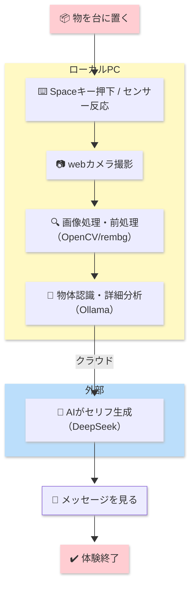
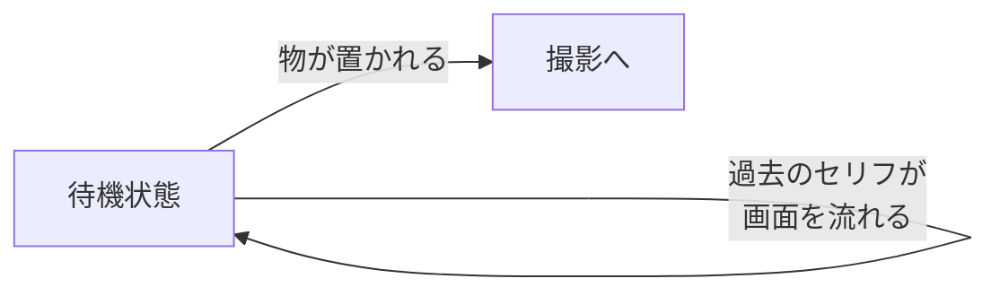
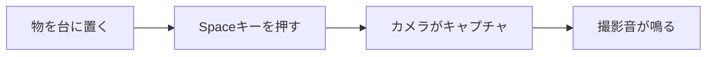
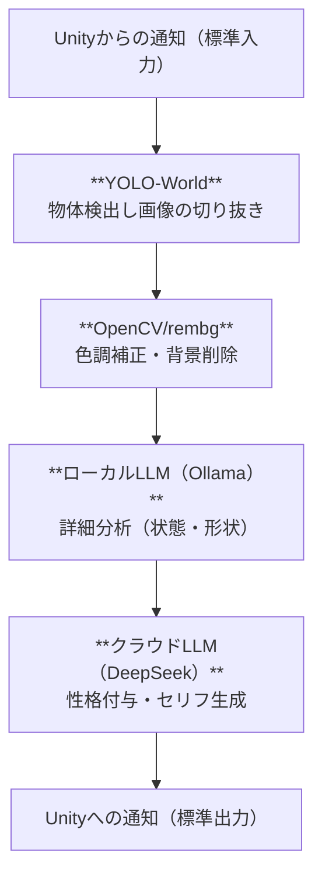
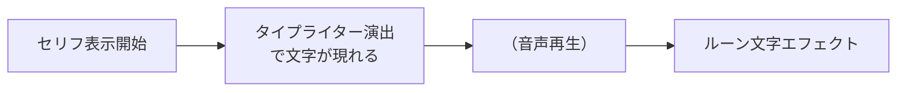
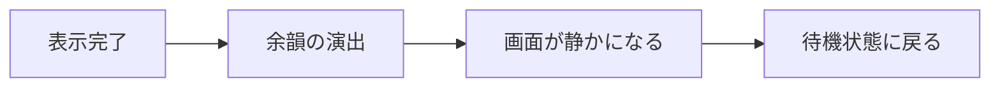
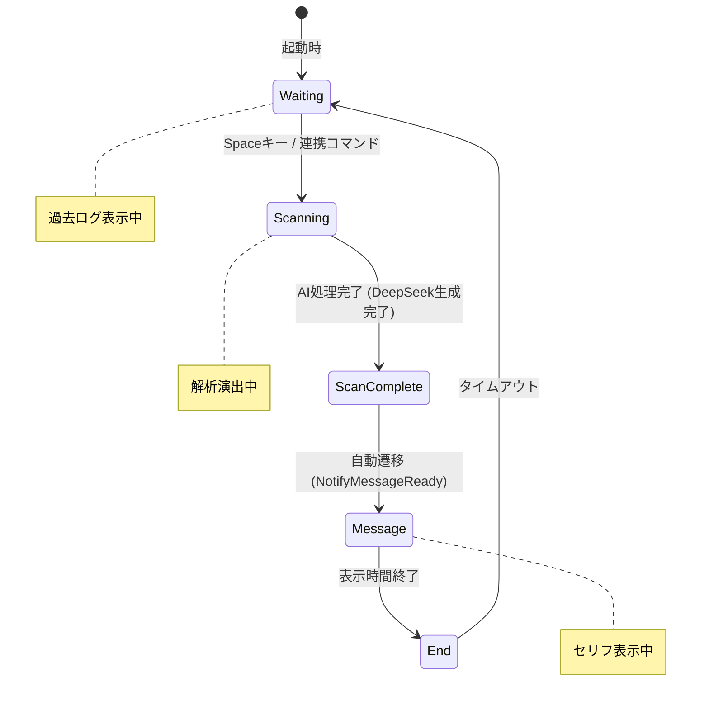

# 作品体験フロー

Last Updated: 2026-02-10

本ドキュメントでは、インスタレーション作品「Mono-Logue」の体験フローを、図とテキストで解説します。

---

## 体験フロー全体図

---

## フェーズ別 詳細解説

### フェーズ① 待機状態（Waiting）

| 項目 | 内容 |
|------|------|
| **体験者の状態** | 作品の前に立ち、物を置くことを促される |
| **画面表示** | マトリックス風に過去の「モノの言葉」が流れている |
| **BGM** | 環境音楽が静かに再生 |

---

### フェーズ② 撮影（Capture）

| 項目 | 内容 |
|------|------|
| **体験者のアクション** | 台の上に持ち物（スマホ、鍵、財布など）を置き、Spaceキーを押す |
| **システムの動作** | Webカメラが物体を撮影し、画像を保存 (Unity → Python連携) |
| **フィードバック** | 撮影音（シャッター音）で撮影完了を知らせる |

---

### フェーズ③ スキャン・解析（Scanning）

| 項目 | 内容 |
|------|------|
| **画面表示** | 「Scanning...」「Analyzing...」などの演出 |
| **物体認識** | YOLO-Worldで検出後、Ollamaで詳細（形状、古さなど）を分析 |
| **セリフ生成** | DeepSeekにより、物体の状態に基づいた「本音」と「異名」を生成 |
| **音声合成** | ※現在は無効化設定中（COEIROINK連携機能あり） |
| **所要時間** | 約10〜20秒 |

---

### フェーズ④ メッセージ表示（Monologue）

| 項目 | 内容 |
|------|------|
| **画面表示** | 生成されたセリフがタイプライターアニメーションで表示 |
| **音声** | ※現在は無効化設定中 |
| **視覚エフェクト** | ルーン文字が浮かび上がる演出 |
| **サブ画面** | 解析結果とセリフがログとして表示 |

---

### フェーズ⑤ 終了・余韻（End）

| 項目 | 内容 |
|------|------|
| **体験者の状態** | セリフを受け止める / 次の物を試す準備 |
| **画面** | 短い余韻を経て、再び待機画面に遷移 |
| **ループ** | 別の物を置けば、また体験が始まる |

---

## 状態遷移図（システム視点）

---

## 体験の流れ（まとめ）

| 順番 | フェーズ | 体験者 | システム |
|------|---------|--------|----------|
| 1 | 待機 | 作品の前に立つ | 過去のセリフを表示 |
| 2 | 撮影 | 物を置き、Spaceキーを押す | コマンド受信 → 撮影・保存 |
| 3 | 解析 | 待つ | YOLO検出 → Ollama分析 → DeepSeek生成 |
| 4 | 独白 | 見る | セリフ表示（タイプライター） |
| 5 | 終了 | 余韻を味わう | 待機状態へ戻る |

---