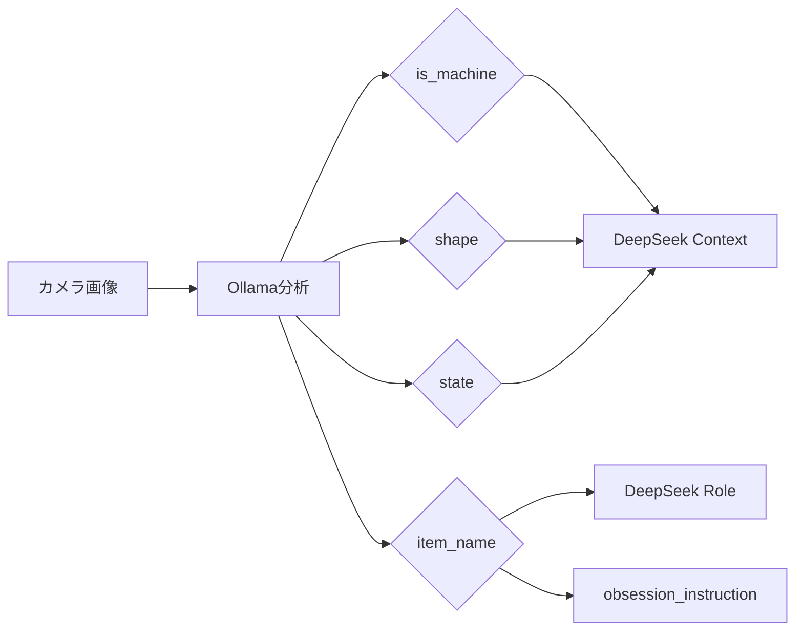

# Ollama プロンプト分析レポート (画像分析)

本レポートでは、`Ollama` (画像分析) モデルのプロンプト構造とロジックについて記述します。

> [!NOTE]
> DeepSeek (対話生成) のプロンプトについては、[DeepSeekPromptDetailedReport.md](../Report/DeepSeekPromptDetailedReport.md) を参照してください。

---

## 1. 概要

**目的**: 撮影された画像を分析し、オブジェクトの特徴、状態、名前を特定する。

| 項目 | 値 |
|------|---|
| **モデル** | `qwen3-vl:8b` (デフォルト) |
| **クライアントファイル** | [ollama_client.py](../Assets/StreamingAssets/ollama_client.py) |
| **プロンプトファイル** | [prompts.py](../Assets/StreamingAssets/prompts.py) |

---

## 2. プロンプト構成

プロンプトは単一のテキストブロックとして画像データと共に送信されます。Chain-of-Thought (CoT) 手法を使用して精度を向上させています。

### `prompts.ANALYSIS_PROMPT`

```text
You are an expert object analyst. Follow these steps carefully:

**Step 1: OBSERVATION**
List the visual features you observe:
- Colors and textures
- Shape and size
- Material (metal, plastic, glass, fabric, etc.)
- Condition (scratches, dust, shine, wear)
- Any text or logos visible

**Step 2: REASONING**
Based on your observations, explain:
- Why you think this is or isn't a machine/electronic device
- What the overall shape category is and why
- What condition/state the object appears to be in

**Step 3: FINAL ANSWER**
Output your conclusion in strict JSON format:
{
  "is_machine": true/false,
  "shape": "Round/Sharp/Square/Other",
  "state": "Old/New/Dirty/Broken/Normal",
  "item_name": "Object Name"
}
```

---

## 3. プロンプト設計の解説

### Step 1: OBSERVATION (観察)

モデルに画像の視覚的特徴を列挙させます：

| 観察項目 | 説明 |
|---------|-----|
| Colors and textures | 色と質感 |
| Shape and size | 形状とサイズ |
| Material | 素材（金属、プラスチック、ガラス、布など） |
| Condition | 状態（傷、ホコリ、光沢、摩耗） |
| Text or logos | テキストやロゴ |

### Step 2: REASONING (推論)

観察結果に基づいて判断の理由を説明させます：

- 機械/電子機器かどうかの判断理由
- 形状カテゴリの判断理由
- 状態の評価

### Step 3: FINAL ANSWER (最終回答)

厳密なJSONフォーマットで出力を強制：

```json
{
  "is_machine": true,
  "shape": "Square",
  "state": "Normal",
  "item_name": "smartphone"
}
```

---

## 4. 出力フィールド

| フィールド | 型 | 選択肢 / 説明 |
|-----------|---|-------------|
| `is_machine` | boolean | `true` / `false` - 機械/電子機器かどうか |
| `shape` | string | `Round` / `Sharp` / `Square` / `Other` |
| `state` | string | `Old` / `New` / `Dirty` / `Broken` / `Normal` |
| `item_name` | string | オブジェクトの名前（英語） |

---

## 5. 実行パラメータ

| パラメータ | 値 | 理由 |
|-----------|---|------|
| **Temperature** | `0.1` | 一貫した分析のため、ランダム性を低く設定 |
| **Top P** | `0.9` | 高確率トークンに集中 |
| **Num Predict** | `512` | トークン制限（長すぎる出力を防止） |

---

## 6. 出力の利用先

Ollamaの分析結果は、以下の用途でDeepSeekへ渡されます：

1. **item_name** → DeepSeekの `Role` 指定、`obsession_instruction` のマッチング
2. **is_machine** → `context_str` およびペルソナ判定
3. **shape** → `context_str` およびペルソナ判定
4. **state** → `context_str` およびペルソナ判定



---

## 7. 具体例

### 入力画像: スマートフォン

**Ollamaの推論（Step 1-2）**:
```
Step 1: OBSERVATION
- Colors: Black with silver edges
- Shape: Rectangular, flat
- Material: Glass front, metal frame
- Condition: Minor fingerprints, no scratches
- Text: Apple logo visible

Step 2: REASONING
- This is clearly an electronic device (smartphone)
- Shape is rectangular/square category
- Condition appears normal with regular use signs
```

**最終出力（Step 3）**:
```json
{
  "is_machine": true,
  "shape": "Square",
  "state": "Normal",
  "item_name": "smartphone"
}
```

### 入力画像: 古いメジャー

**最終出力**:
```json
{
  "is_machine": false,
  "shape": "Other",
  "state": "Old",
  "item_name": "tape measure"
}
```
