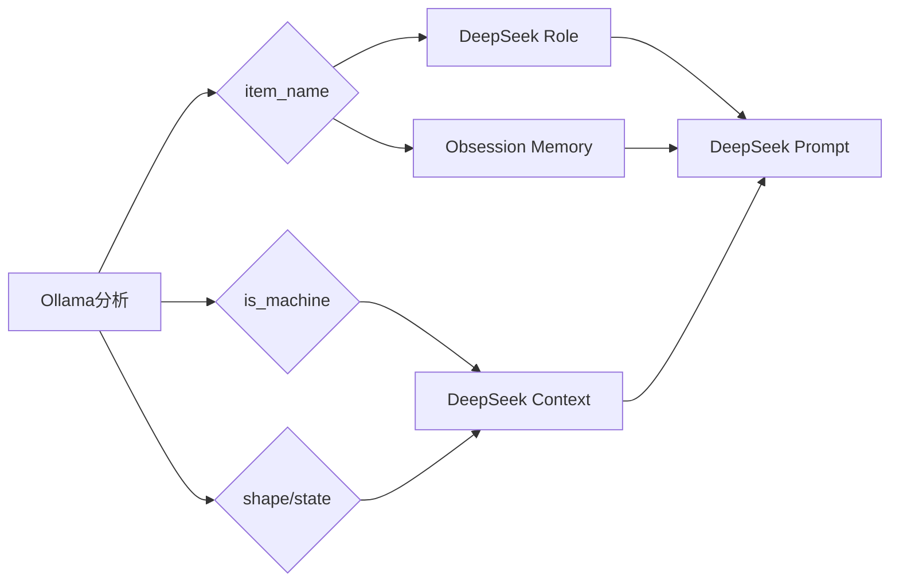

# Ollama プロンプト分析レポート (画像分析)

Last Updated: 2026-02-10

本レポートでは、`Ollama` (画像分析) モデルのプロンプト構造とロジックについて記述します。

> [!NOTE]
> DeepSeek (対話生成) のプロンプトについては、[DeepSeekPromptDetailedReport.md](../Report/DeepSeekPromptDetailedReport.md) を参照してください。

---

## 1. 概要

**目的**: 撮影された画像を分析し、オブジェクトの特徴、状態、名前を特定する。

| 項目 | 値 |
|------|---|
| **モデル** | `qwen3-vl:8b` (推奨) / `moondream` など |
| **クライアント** | [ollama_client.py](../Assets/StreamingAssets/ollama_client.py) |
| **定義ファイル** | [prompts.py](../Assets/StreamingAssets/prompts.py) |

---

## 2. プロンプト構成

プロンプトは単一のテキストブロックとして画像データと共に送信されます。Chain-of-Thought (CoT) 手法を使用して精度を向上させています。
また、YOLOによる検出結果がある場合は、それを「ヒント」として与える別のプロンプトが使用されます。

### A. 通常プロンプト (`prompts.ANALYSIS_PROMPT`)

```text
You are an expert object analyst. Analyze the image following these steps:

**CONTEXT:**
The image shows an object placed on a SQUARE DISPLAY STAND/PLATFORM.
- You must IGNORE the square stand and focus ONLY on the object placed ON TOP of it.

**Step 1: OBSERVATION**
Describe what you see:
- Colors, textures, and materials
- Overall shape and proportions
- Surface condition (scratches, dust, shine, stains, wear marks)
- Any visible text, logos, brand names, or markings

**Step 2: REASONING**
Based on your observations:
- Is this an electronic/mechanical device?
- What shape category best describes it?
- What is the overall condition?
- What is the most specific name for this object?

**Step 3: FINAL ANSWER**
Output ONLY the following JSON. No additional text before or after:
...
```

### B. ヒント付きプロンプト (`prompts.ANALYSIS_PROMPT_WITH_HINT`)

YOLO等でオブジェクトが検出された場合に使用されます。

```text
You are an expert object analyst.

**DETECTION HINT:** "{yolo_hint}"
This hint comes from an automated detection system. Use it as a starting point, but verify through careful observation. The hint may be inaccurate.

... (以降はContext, Observation, Reasoning, Final Answerと同じ流れ)
```

---

## 3. プロンプト設計の解説

### Context (文脈)
「四角い展示台の上に置かれている」という状況を明示し、**「台座を物体として誤認識しない」**ように指示しています。

### Step 1: OBSERVATION (観察)
モデルに画像の視覚的特徴（色、素材、傷、ロゴなど）を列挙させ、幻覚を防ぎます。

### Step 2: REASONING/VERIFICATION (推論/検証)
観察結果に基づき、機械判定や形状判定の論理的な根拠を出力させます。ヒントがある場合は、そのヒントが正しいかどうかの検証も行います。

### Step 3: FINAL ANSWER (最終回答)
厳密なJSONフォーマットで出力を強制します。

```json
{
  "is_machine": true,
  "shape": "Square",
  "state": "Normal",
  "item_name": "smartphone",
  "item_category": "machine",
  "confidence": 0.95
}
```

---

## 4. 出力フィールド定義

| フィールド | 型 | 説明 / 選択肢 |
|-----------|---|-------------|
| `is_machine` | boolean | `true` (機械/電子機器), `false` (その他) |
| `shape` | string | `Round`, `Sharp`, `Square`, `Other` |
| `state` | string | `Old`, `New`, `Dirty`, `Broken`, `Normal` |
| `item_name` | string | 具体的なオブジェクト名（日本語推奨だが英語も可） |
| `item_category` | string | `machine`, `cloth`, `container`, `stationery`, `leather`, `metal`, `other` |
| `confidence` | float | `0.0` - `1.0` (識別自信度) |

---

## 5. 出力の利用先

Ollamaの分析結果は、DeepSeekへの入力コンテキストとして使用されます：

1. **item_name**
    - DeepSeekの `Role` 指定
    - `item_obsessions.py` とのマッチング（固有メモリの注入）
2. **is_machine**
    - DeepSeekの `Context` 情報
    - ペルソナ（口調）の判定 (`is_machine=True` → 観察的な口調)
3. **shape / state**
    - DeepSeekの `Context` 情報
    - ペルソナ（口調）の判定 (`Round`→優しく, `Old`→ゆっくり等)



---
