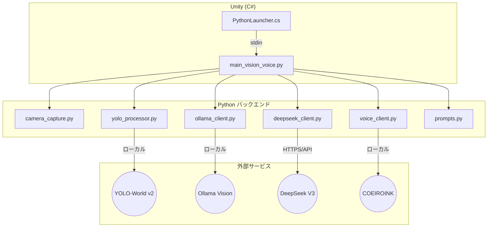
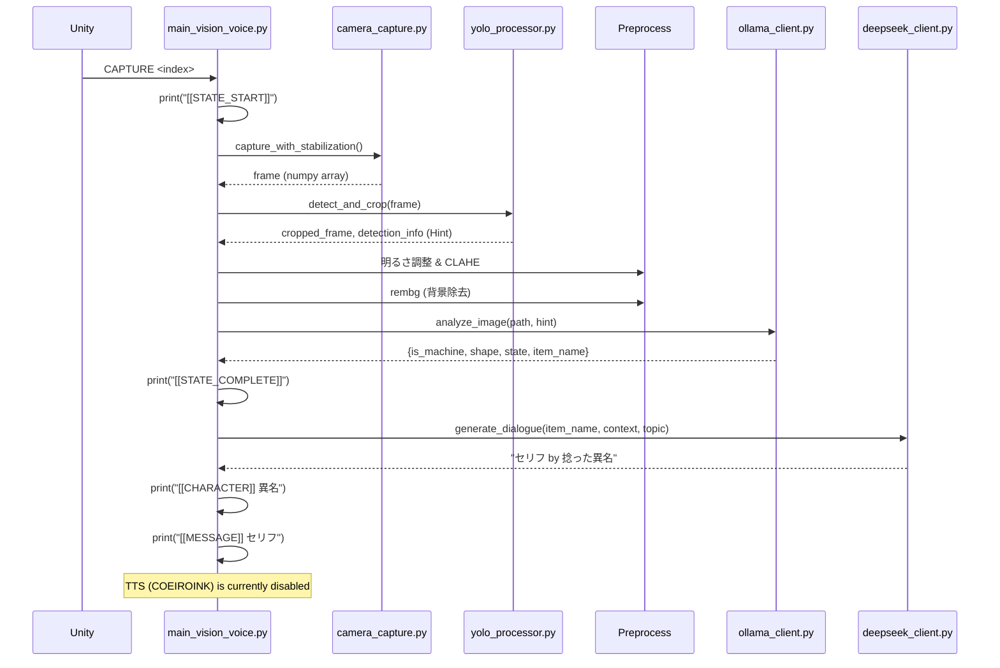

# Python スクリプト構造・ロジックレポート

Last Updated: 2026-02-10
対象ディレクトリ: `Assets/StreamingAssets/`

本ドキュメントでは、Python スクリプトの構造、役割、および主要なロジックフローを詳細に解説します。

---

## 1. システムアーキテクチャ概要



---

## 2. 処理パイプライン



---

## 3. スクリプト詳細

### 🔵 メインオーケストレーター

#### [main_vision_voice.py](../Assets/StreamingAssets/main_vision_voice.py)
**役割:** 全体の処理フローを統括。stdin監視、各モジュール呼び出し、stdout出力

**主要関数:**

| 関数名 | 役割 |
|:---|:---|
| `stdin_listener()` | Unityからのstdinコマンドを監視するスレッド |
| `process_frame(frame)` | カメラフレームを処理（YOLO→前処理→Ollama分析） |
| `_process_analysis(...)` | 分析結果からDeepSeekでセリフ生成 |
| `determine_persona(...)` | **(旧ロジック)** プロンプト生成用のコンテキスト情報を整理 |
| `apply_intelligent_brightness()` | ガンマ補正と輝度ベースアップによる明るさ調整 |

**stdinコマンド処理:**
- `CAPTURE <index>`: 指定したカメラインデックスで撮影を開始
- `QUIT`: プロセス終了

**ペルソナ決定:**
プロンプト側での動的生成に移行したため、旧来の「5段階優先度」は削除され、Ollamaの分析結果（状態・形状など）をコンテキストとしてDeepSeekに渡す方式に変更されました。

---

### 🟢 カメラ制御

#### [camera_capture.py](../Assets/StreamingAssets/camera_capture.py)
**役割:** フリッカー対策付きカメラ撮影モジュール

**主要機能:**
- **フリッカー対策**: 5フレーム撮影し、中央値（Median）を計算することで蛍光灯のチラつきを除去
- **ウォームアップ**: 撮影前に数フレーム捨てて、カメラの自動露出を安定させる
- **仮想カメラ除外**: 「OBS」「Virtual」等の名前を含むデバイスを自動的に除外 (macOS/Windows対応)

---

### 🟡 オブジェクト検出・前処理

#### [yolo_processor.py](../Assets/StreamingAssets/yolo_processor.py)
**役割:** YOLO-World (yolov8s-worldv2.pt) によるオブジェクト検出とクロップ

**ロジック:**
- **検出数0**: 元画像をそのまま使用
- **検出数1**: 単一オブジェクトをクロップ（マージン比率0.1）
- **検出数2+**: 全オブジェクトを含む統合バウンディングボックスでクロップ
- **ヒント生成**: 検出されたクラス名（信頼度付き）をOllamaへのヒントとして提供

#### [main_vision_voice.py] (Preprocess)
**役割:** 画像の視認性向上と背景除去

1. **Intelligent Brightness**: ガンマ補正(1.5) + 暗部底上げ
2. **CLAHE**: 局所的なコントラスト強調
3. **rembg**: 背景を除去し、対象物を明確化

---

### 🔴 AI クライアント

#### [ollama_client.py](../Assets/StreamingAssets/ollama_client.py)
**役割:** ローカルOllama（Vision Model）への詳細分析リクエスト
**使用モデル:** Vision対応モデル（例: `qwen3-vl`, `moondream` 等）

**分析内容:**
- 形状（Round/Sharp/Square）
- 状態（Old/New/Dirty/Broken）
- アイテム名（具体的な名称）

#### [deepseek_client.py](../Assets/StreamingAssets/deepseek_client.py)
**役割:** DeepSeek APIへのセリフ生成リクエスト

**生成内容:**
- **セリフ**: 物体の「本音」や「気づき」（最大60文字）
- **異名 (Twisted Name)**: 「全部知ってるスマホ」「字の汚さを知るペン」のような、物体の性質を表すユニークな名前

#### [voice_client.py](../Assets/StreamingAssets/voice_client.py)
**役割:** COEIROINK（ローカルTTS）への音声合成リクエスト
**(※現在、main_vision_voice.py 内で呼び出しが無効化されています)**

---

### 🟣 プロンプト設定

#### [prompts.py](../Assets/StreamingAssets/prompts.py)
**役割:** DeepSeekおよびOllamaへの指示定義

| 定数名 | 用途 |
|:---|:---|
| `ANALYSIS_PROMPT_WITH_HINT` | YOLOの検出結果（ヒント）を含めたOllama分析プロンプト |
| `CORE_LOGIC` | 物体の「本音」を語らせるためのコア指示 |
| `PERSONA_LOGIC` | 状態（Old/Machine/Round）に応じた口調の微調整指示 |
| `GEMINI_TASK` | 60文字制限と出力フォーマット（セリフ by 異名）の定義 |

---

## 4. ファイル構造

```
StreamingAssets/
├── main_vision_voice.py      # メインスクリプト
├── camera_capture.py         # カメラ制御
├── yolo_processor.py         # YOLO検出
├── ollama_client.py          # Ollama連携
├── deepseek_client.py        # DeepSeek連携
├── voice_client.py           # 音声連携 (無効化中)
├── prompts.py                # プロンプト定義
├── item_obsessions.py        # アイテム定義
├── category_mapping.py       # カテゴリマッピング
├── config.json               # 設定ファイル
├── .env                      # APIキー
├── yolov8s-worldv2.pt        # YOLOモデル
└── capture/                  # 撮影画像保存先
```

---

## 5. 依存ライブラリ

- `ultralytics` (YOLO)
- `opencv-python` (画像処理)
- `rembg` (背景除去)
- `ollama` (ローカルVision)
- `openai` (DeepSeek API用)
- `watchdog` (ファイル監視)
