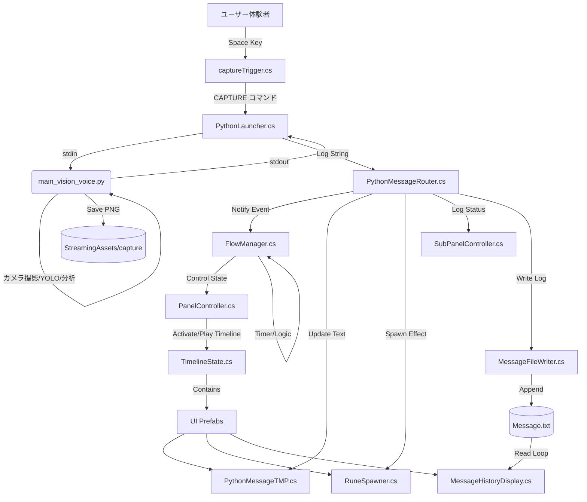

# Mono-Logue スクリプト構造・関係性レポート

本ドキュメントでは、`Assets/Scripts` 内の主要スクリプトの機能、役割、および相互関係についてまとめます。

## 1. システム全体概要

本プロジェクトは、**状態遷移（State Machine）** を中心としたインタラクティブシステムです。
Unityがフロントエンド（表示・演出・入力）を担当し、Pythonプロセス（`main_vision_voice.py`）がバックエンド（画像認識・テキスト生成・音声合成）を担当しています。

### アーキテクチャ図 (Mermaid)

> [!NOTE]
> Python側でカメラ撮影・YOLO・CLAHE・背景除去・Ollama分析・DeepSeekセリフ生成・COEIROINK音声合成を実行します。
> 詳細は [PythonScripts.md](./PythonScripts.md) を参照してください。

---

## 2. 主要スクリプト分類

### Core Managers (全体制御)

| スクリプト名 | 役割 | 依存関係・備考 |
| :--- | :--- | :--- |
| **FlowManager.cs** | **ステートマシンの中核**。体験フロー（Waiting, Scanning, ScanComplete, Message, End）を管理し、状態に応じて各コントローラーに指示を出す。 | `PanelController`, `PythonMessageTMP`, `SubPanelController` |
| **PanelController.cs** | メイン画面のUIパネル切り替えを担当。各状態に対応するPrefab (`TimelineState`) を生成・表示制御する。 | `TimelineState` |
| **SubPanelController.cs** | サブディスプレイ（状況ログ表示用）の制御。状態に応じて単純なテキスト表示とタイプライター風ログ表示を切り替える。 | `TypewriterEffectTMP` |

### Python Integration (外部連携)

| スクリプト名 | 役割 | 依存関係・備考 |
| :--- | :--- | :--- |
| **PythonLauncher.cs** | Pythonプロセスの起動・監視・終了。**stdinへのコマンド送信**とstdoutのキャプチャを行う。 | `PythonMessageRouter` |
| **PythonMessageRouter.cs** | Pythonからのログ出力を解析する **"司令塔"**。タグを検知し、`FlowManager`への通知やUIへのテキスト反映を行う。 | `FlowManager`, `PanelController`, `RuneSpawner` |

### Visual Effects & UI (演出・表示)

| スクリプト名 | 役割 | 依存関係・備考 |
| :--- | :--- | :--- |
| **TimelineState.cs** | 各状態のUIプレハブにアタッチされる。`Enter()`/`Exit()` 時にGameObjectのActive切り替えやTimeline (PlayableDirector) の再生を行う。 | `PlayableDirector` |
| **MessageHistoryDisplay.cs** | `Waiting` 状態で、過去のメッセージ (`Message.txt`) をランダムに流し続ける演出（Matrix風）。 | File IO |
| **RuneSpawner.cs** | 指定されたメッセージ（文字）を空間に浮遊させる演出（ルーン文字エフェクト）。 | `RuneBehavior` |
| **PythonMessageTMP.cs** | 生成されたメッセージ本文とクレジットを表示するコンポーネント。タイプライター演出を含む。 | `TypewriterEffectTMP` |
| **MessageWindowAnimation.cs** | `MessageHistoryDisplay` で生成される各テキストウィンドウの浮遊アニメーション制御。 | - |
| **ImageCutoff.cs** | 画像の `SpriteMask` を操作して、カットオフ演出（徐々に表示されるなど）を行う汎用エフェクト。 | `SpriteMask` |
| **ImageFader.cs** | UI画像のフェードイン/アウトを行う汎用エフェクト。 | `Image` |

### Input & Data (入力・データ)

| スクリプト名 | 役割 | 依存関係・備考 |
| :--- | :--- | :--- |
| **captureTrigger.cs** | キー入力（Spaceキー）を検知し、**Pythonに`CAPTURE`コマンドを送信**。カメラ名キーワードで正しいカメラインデックスを特定。3秒のクールダウン付き。 | `PythonLauncher`, `FlowManager` |
| **WebCamCapture.cs** | **現在は未使用**（Python側でカメラ撮影を実行）。バックアップとして残している。 | - |
| **MessageFileWriter.cs** | 受信したメッセージを `Message.txt` に追記保存するユーティリティ。 | File IO |
| **MessageFileManager.cs** | `Message.txt` の更新を監視する（主にデバッグや外部連携用）。 | File IO |

---

## 3. データと処理の詳細フロー

### A. 待機状態 (Waiting)
1. **FlowManager** が `Waiting` 状態になる。
2. **PanelController** が `State_Waiting` プレハブを表示。
3. 同プレハブ内の **MessageHistoryDisplay** が起動し、`Message.txt` から過去ログを読み込んで画面に流し続ける。
4. ユーザーが Spaceキー を押すと、**captureTrigger** が `CAPTURE` コマンドを **PythonLauncher** 経由でPythonに送信。

### B. 解析・スキャン (Scanning)
1. Pythonが`CAPTURE`コマンドを受信し、カメラ撮影→YOLO→前処理→Ollama分析を開始。
2. Pythonが `[[STATE_START]]` を出力。
3. **PythonLauncher** が出力を受信 → **Router** が解析。
4. **Router** が `FlowManager.NotifyScanStart()` を呼ぶ。
5. **FlowManager** が `Scanning` 状態へ移行。
6. **PanelController** が `State_Scanning` プレハブ（スキャン演出）に切り替え。

### C. 生成完了・表示 (ScanComplete -> Message)
1. Pythonが `Generating dialogue...` または `[[STATE_COMPLETE]]` を出力。
2. **Router** が `FlowManager.NotifyScanComplete()` を呼ぶ。
3. **FlowManager** が `ScanComplete` 状態へ。
4. **RuneSpawner** が（設定により）ルーン文字演出を開始する準備を行う。
5. 数秒後、**FlowManager** が自動的に `Message` 状態へ移行。
6. Pythonが `[[MESSAGE]] こんにちは` を出力。
7. **Router** が解析し、以下を実行：
    - **PythonMessageTMP.ReceiveMessage()**: メイン画面にテキストを表示。
    - **MessageFileWriter.Write()**: ファイルに保存。
    - **RuneSpawner.SetMessage()**: ルーン文字として射出。
    - **SubPanelController**: サブ画面にログを追加。

### D. 終了 (End)
1. 一定時間経過後、**FlowManager** が `End` 状態へ。
2. **PanelController** が `State_End`（終了演出）を表示。
3. 更に時間が経つと `Waiting` へ戻る。

---

## 4. 開発者向けメモ：構造上のポイント

- **疎結合設計**: `FlowManager` は「状態」のみを管理し、メッセージの中身には関知しません。メッセージの解析は `PythonMessageRouter` に委任されています。これにより、Python側の出力フォーマットが変わっても `FlowManager` を修正する必要がありません。
- **Prefabによる画面管理**: 各状態のUIはProjectウィンドウ上のPrefabとして管理され、実行時に `PanelController` がインスタンス化（または表示切替）します。これにより、シーンファイルを汚さずに各画面のデザイン編集が可能です。
- **自動接続**: `PythonMessageRouter` は、`PanelController` を通じて動的に生成された `State_Message` プレハブ内の `PythonMessageTMP` を自動的に探して接続するロジック(`TryGetDisplaysFromPanelController`)を持っています。これにより、Prefabが動的に入れ替わっても参照リンクが維持されます。

---

## 5. 未使用・レガシー (削除検討対象)

以下のスクリプトは、現在の主要なシステムの依存関係に含まれておらず、過去の実装または代替実装と考えられます。

| スクリプト名 | 現状の分析 | 推奨アクション |
| :--- | :--- | :--- |
| **MessageSystemController.cs** | `MessageWindowManager` と `MessageFileManager` を接続するイベント管理クラスですが、現在の `FlowManager` ベースのシステムからは参照されていません。 | **削除検討** (バックアップ推奨) |
| **MessageWindowManager.cs** | メッセージを複数のウィンドウで浮遊表示させる実装。現在は `MessageHistoryDisplay` (Matrix風表示) が採用されているため、未使用の可能性があります。 | **削除検討** (プレハブで使われていないか確認後) |
| **LogBufferDisplay.cs** | 古いログ表示コンポーネント。現在は `SubPanelController` がログ表示を担当しているため、不要と思われます。 | **削除検討** |

## 6. スタンドアローン・ユーティリティ (参照はないが機能している可能性あり)

以下のスクリプトは、他のスクリプトから直接参照されていませんが、シーン内のオブジェクトにアタッチされて単独で機能している（Activeな）可能性があります。

| スクリプト名 | 機能 |
| :--- | :--- |
| **MessageVoicePlayer.cs** | `StreamingAssets/voice` フォルダを監視し、音声ファイルが生成されると自動再生します。コード参照は少ないですが、システムにとって**重要な構成要素**です（FlowManagerと連携あり）。 |
| **InputExitHandler.cs** | `ESC` キーでの終了や、`X` キー3連打でのキャッシュ削除機能を提供します。 |
| **ActivateSubDisplay.cs** | マルチディスプレイ環境で2画面目をアクティブにする初期化スクリプト。 |
| **DynamicFontManager.cs** | Addressablesを使用してフォントを動的にロードする管理スクリプト。 |
| **ImageRotator.cs** | 画像を回転させる単純な演出用スクリプト。 |
| **SlideAnimation.cs** | UIのスライドアニメーション用。`LogBufferDisplay` で使用されていますが、単体でも利用可能な汎用クラスです。 |

