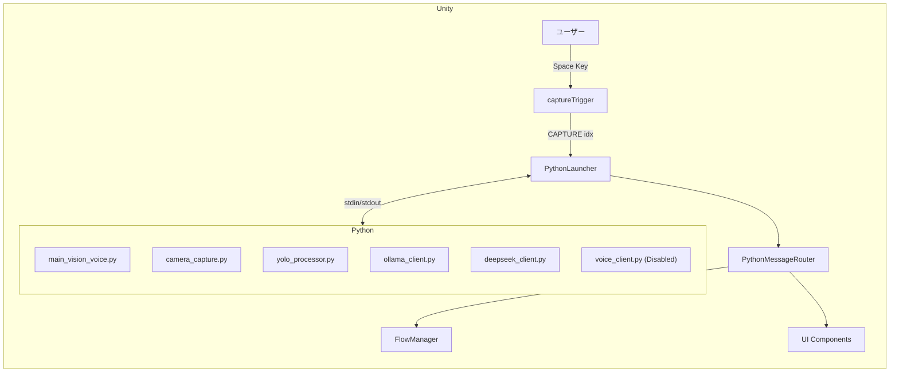
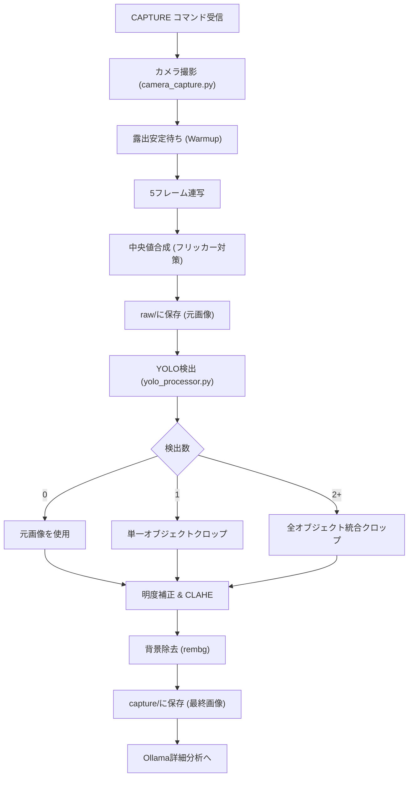
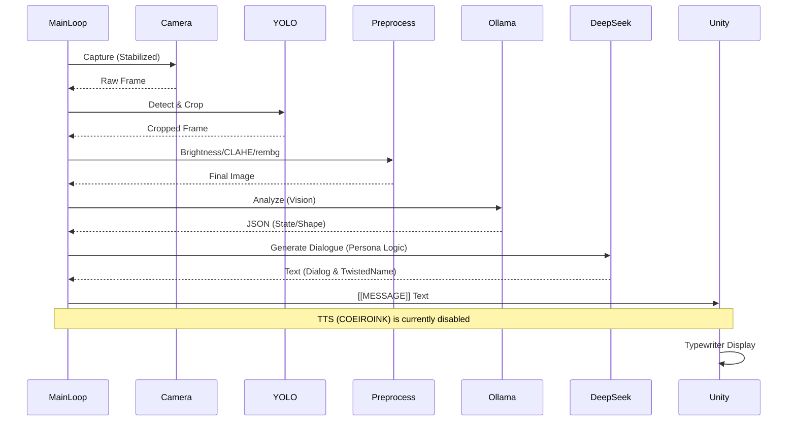
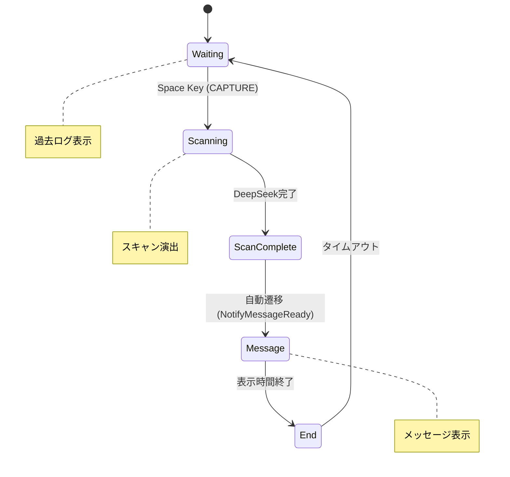

# Mono-Logue ワークフロー図

Last Updated: 2026-02-10

システム全体の処理フローをMermaid図で可視化します。

---

## 全体アーキテクチャ



---

## 画像処理フロー



---

## 分析〜音声生成フロー



---

## 状態遷移図



---

## フォルダ構造

```
StreamingAssets/
├── capture/
│   ├── raw/           # 元画像 (タイムスタンプ付き)
│   └── camera_*.png   # 最終画像 (背景透過・補正済み)
├── voice/             # 音声ファイル (現在は生成されません)
├── main_vision_voice.py
├── camera_capture.py
├── yolo_processor.py
├── ollama_client.py
├── deepseek_client.py
├── voice_client.py
└── prompts.py
```

---

## 関連ドキュメント

- [ScriptArchitecture.md](./ScriptArchitecture.md) - Unity C#スクリプト構造
- [PythonScripts.md](./PythonScripts.md) - Pythonモジュール詳細
