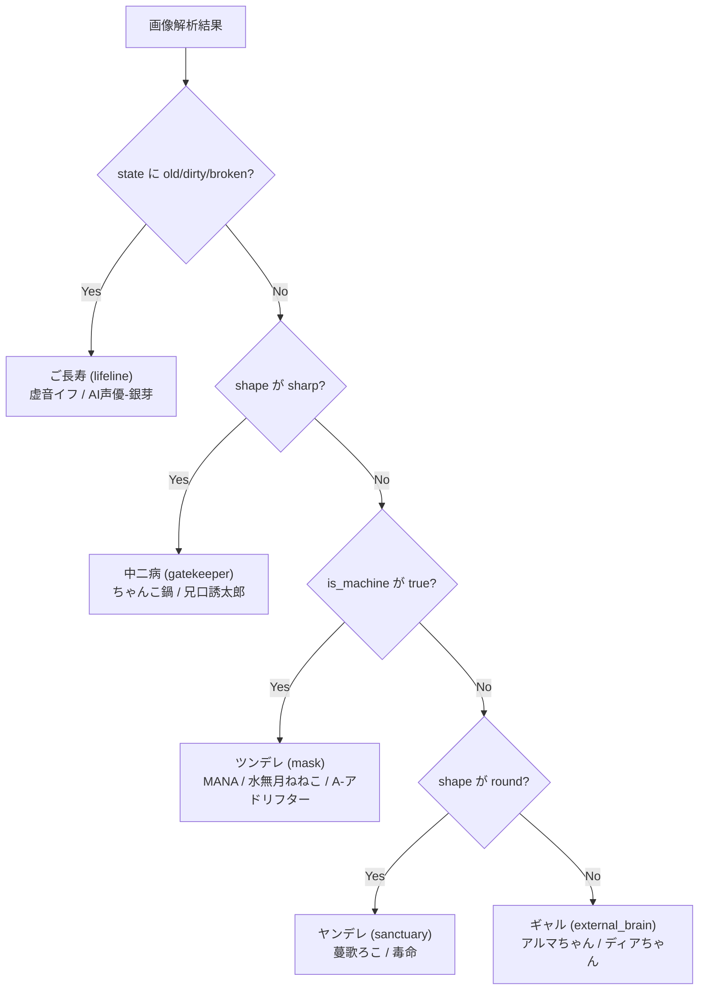

# COEIROINK 音声設定レポート

**作成日:** 2025-12-18  
**対象ファイル:** `config.json`, `main_vision_voice.py`

## 概要

本レポートでは、COEIROINKの音声合成における性格判定ロジックと、各性格に割り当てられた音声キャラクターの設定をまとめています。

---

## 性格判定ロジックと音声キャラクター対応表

| 優先度 | 判定条件 | 性格（Role） | Persona ID | 音声キャラクター |
|:---:|:---|:---:|:---:|:---|
| 1 | `state` が Old / Dirty / Broken | ご長寿 | `lifeline` | 虚音イフ, AI声優-銀芽 |
| 2 | `shape` が Sharp | 中二病 | `gatekeeper` | ちゃんこ鍋, 兄口誘太郎-くちなわ |
| 3 | `is_machine` が True | ツンデレ | `mask` | MANA, 水無月ねねこ, A-アドリフター |
| 4 | `shape` が Round | ヤンデレ | `sanctuary` | 蔓歌ろこ, 毒命 |
| 5 | デフォルト（上記いずれにも該当しない） | ギャル | `external_brain` | アルマちゃん, ディアちゃん |

> [!NOTE]
> 各性格には2つの音声バリエーションがあり、`random.choice`によりランダムに選択されます。

---

## 未使用の設定

`config.json`には以下の設定も存在しますが、現在の`determine_persona`関数では使用されていません。

| Persona ID | 性格 | 音声キャラクター |
|:---|:---:|:---|
| `muse` | 沈黙の詩人 | 波音リツ, 雨晴はう |
| `observer` | 運命の鏡 | A-アドリフター, 兄口誘太郎-くちなわ |

---

## 判定フロー図

---

## 関連ファイル

- [config.json](../Assets/StreamingAssets/config.json) - 音声設定・性格プロンプト定義
- [main_vision_voice.py](../Assets/StreamingAssets/main_vision_voice.py) - 性格判定ロジック (`determine_persona`関数)
