# 処理フロー分析：Scanning から Message まで

このドキュメントでは、キャプチャが開始されてからAIが生成したメッセージが表示されるまでの、一連のイベント順序、ログトリガー、および状態遷移の詳細を記述します。

## シーケンス・ダイアグラム

```mermaid
sequenceDiagram
    participant Unity as Unity (FlowManager/Router)
    participant PyMain as Python (Main)
    participant PyCam as Camera
    participant PyAI as AI Clients (Ollama/DeepSeek)

    Note over Unity: FlowState: Waiting

    Unity->>PyMain: stdin: CAPTURE 0
    activate PyMain
    
    PyMain->>PyCam: フレームキャプチャ
    PyCam-->>PyMain: フレームデータ
    
    PyMain->>PyMain: ログ出力 "[[STATE_START]] Processing..."
    PyMain-->>Unity: stdout: [[STATE_START]]...
    
    rect rgb(0, 40, 0)
    Note over Unity: "[[STATE_START]]" を検出
    Unity->>Unity: FlowState -> Scanning
    end

    PyMain->>PyMain: YOLO 検出 & クロップ
    PyMain->>PyMain: 画像前処理 (CLAHE/背景除去)
    PyMain->>PyAI: Ollama 画像分析
    PyAI-->>PyMain: 分析結果 (JSON)
    
    PyMain->>PyAI: DeepSeek 対話生成
    PyAI-->>PyMain: 生成テキスト
    
    Note right of PyAI: *暗黙的な出力*
    PyAI-->>Unity: stdout: "HTTP ... 200 OK" (DeepSeekリクエストログ)
    
    rect rgb(0, 0, 40)
    Note over Unity: "HTTP...200 OK" & "deepseek" を検出
    Unity->>Unity: FlowState -> ScanComplete
    end
    
    PyMain->>PyMain: ログ出力 "[[MESSAGE]] ..."
    PyMain-->>Unity: stdout: [[MESSAGE]] ...
    
    rect rgb(40, 0, 0)
    Note over Unity: "[[MESSAGE]]" を検出
    Unity->>Unity: Router: NotifyMessageReady()
    Note over Unity: チェック: 現在の状態は ScanComplete か？
    Unity->>Unity: FlowState -> Message
    end

    PyMain->>PyMain: 音声合成 (TTS) 生成
    deactivate PyMain
```

## 詳細なトリガーと遷移条件

### 1. スキャン開始 (Scanning)
*   **トリガー**: Pythonが `[[STATE_START]] Processing...` を出力。
    *   *ソース*: `main_vision_voice.py`
*   **Unity側の動作**: `PythonMessageRouter.HandleScanStart` が反応。
*   **状態遷移**: `FlowManager` が **Scanning** 状態に遷移。
    *   *UI表示*: スキャン中パネル（Scanning Panel）が表示される。

### 2. Python内部処理
*   **実行内容**:
    *   YOLOによるオブジェクト検出
    *   明るさ調整、CLAHE、背景除去などの画像前処理
    *   Ollamaによる画像の内容分析 (`ollama_client.py`)
    *   DeepSeekによる対話台詞の生成 (`deepseek_client.py`)

### 3. スキャン完了 (ScanComplete)
*   **トリガー**: Pythonの標準出力に `https://api.deepseek.com/chat/completions`、`HTTP`、および `200 OK` が含まれる。
    *   *ソース*: **非明示的**。`main_vision_voice.py` 内に直接の記述はなく、`deepseek_client.py` が使用している `openai` または `httpx` ライブラリが出力するデバッグログを利用しています。
*   **Unity側の動作**: `PythonMessageRouter.HandleScanComplete` が反応。
*   **状態遷移**: `FlowManager` が **ScanComplete** 状態に遷移。
    *   *UI表示*: スキャン完了パネル（ScanComplete Panel）が表示される。
    *   *重要*: この状態への遷移は、後続のメッセージ表示の**必須条件**となっています。

### 4. メッセージ準備完了 (Message)
*   **トリガー**: Pythonが `[[MESSAGE]] ...` を出力。
    *   *ソース*: `main_vision_voice.py`
*   **Unity側の動作**: `PythonMessageRouter.HandleMessage` が反応。
    *   `FlowManager.NotifyMessageReady()` を呼び出す。
*   **状態遷移**: `FlowManager` が **Message** 状態に遷移（**ただし、現在の状態が `ScanComplete` である場合のみ**）。
    *   *UI表示*: メッセージパネルが表示され、タイプライター演出が開始される。

## 実装上の懸念点 (脆弱性)
`ScanComplete` への遷移が、ユーザーコードで制御されていない外部ライブラリのログ（`HTTP ... 200 OK`）に依存している点は脆弱です。ライブラリのアップデートやログレベルの設定変更によってこのログが出力されなくなると、Unity側が `ScanComplete` 状態にならず、結果としてメッセージが画面に表示されなくなる（`Scanning` 状態のままスタックする）リスクがあります。
