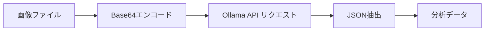

# Ollama プロンプト構成まとめ

> 作成日: 2025-12-18

## 概要

ローカル環境で **Ollama** を使用し、画像を分析してオブジェクト情報をJSON形式で抽出する。この情報がDeepSeekへのコンテキストとして渡される。

---

## 使用技術

| 項目 | 値 |
|------|-----|
| ライブラリ | `ollama` (Python) |
| モデル | `qwen3-vl:8b` (Vision Language Model) |
| Temperature | `0.2`（安定した分析結果を得るため低め） |

---

## 処理フロー



1. **画像読み込み**: 対象画像をBase64エンコード
2. **Ollama APIリクエスト**: ローカルサーバーに画像とプロンプトを送信
3. **JSON抽出**: レスポンスから正規表現でJSONをパース
4. **結果返却**: 分析データをDeepSeekのコンテキストとして使用

---

## 画像分析プロンプト

```
Analyze the image and provide the following details in strict JSON format:

1. "is_machine": Boolean (true if the object is an electronic device or machine, else false).
2. "shape": String (One of: "Round", "Sharp", "Square", "Other").
3. "state": String (One of: "Old", "New", "Dirty", "Broken", "Normal").
4. "item_name": String (Name of the object).
5. "user_appearance": String (Describe the user's visible features: Gender, Expression, Clothes, Accessories. If no user, say "None").

Output strict JSON:
{
  "is_machine": true/false,
  "shape": "Round/Sharp/Square/Other",
  "state": "Old/New/Dirty/Broken/Normal",
  "item_name": "Object Name",
  "user_appearance": "Description string"
}
```

---

## 抽出される情報

| フィールド | 型 | 値の例 | 用途 |
|------------|-----|--------|------|
| `is_machine` | Boolean | `true` / `false` | ペルソナ判定（ツンデレ等） |
| `shape` | String | `Round` / `Sharp` / `Square` / `Other` | ペルソナ判定（ヤンデレ等） |
| `state` | String | `Old` / `New` / `Dirty` / `Broken` / `Normal` | ペルソナ判定（ご長寿等） |
| `item_name` | String | `スマートフォン`, `メガネ` 等 | 擬人化対象の名前 |
| `user_appearance` | String | `Male, smiling, casual clothes` / `None` | セリフへの反映 |

---

## ペルソナ判定への活用

抽出したデータは以下のようにペルソナ判定に使用される：

| 条件 | 判定されるキャラクター |
|------|------------------------|
| `state` = Old/Dirty/Broken | **ご長寿** |
| `shape` = Sharp または (`is_machine` = true かつ 黒色) | **中二病** |
| `is_machine` = true | **ツンデレ** |
| `shape` = Round | **ヤンデレ** |
| その他 | **ギャル** |

---

## エラー時のデフォルト値

JSONパース失敗時は以下のデフォルト値を使用：

```json
{
  "is_machine": false,
  "shape": "Other",
  "state": "Normal",
  "item_name": "Unknown Object",
  "user_appearance": "None"
}
```

---

## 関連ファイル

- `Assets/StreamingAssets/ollama_client.py` - Ollama通信クライアント
- `Assets/StreamingAssets/prompts.py` - プロンプト定義（`ANALYSIS_PROMPT`）
- `Assets/StreamingAssets/main_vision_voice.py` - メイン処理フロー
